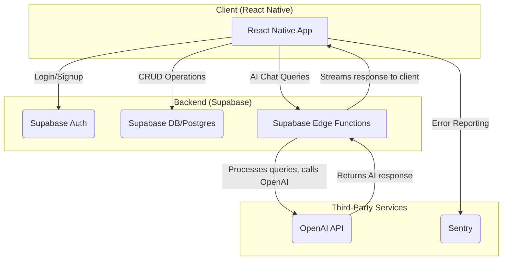
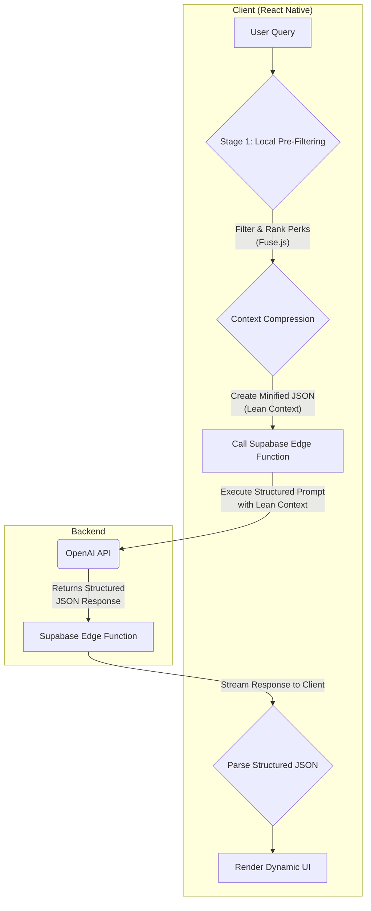

# Credify: Your AI-Powered Smart Credit Card Companion 🚀

**Stop leaving money on the table. Credify is the ultimate app for tracking, managing, and maximizing your credit card benefits, ensuring you get every dollar of value from your annual fees.**

Credify is an intelligent, AI-enhanced command center for your credit card perks. It transforms how you manage your finances by providing a unified dashboard to track and redeem benefits, smart reminders to prevent missed opportunities, and data-driven insights to maximize your return on investment.

  
View Screenshots

  
  
  
  
  
  
  
  
  
  

  

## What is Credify? 🤔

Are you juggling multiple credit cards with a dizzying array of perks? From monthly dining credits and streaming subscriptions to annual travel stipends, it's nearly impossible to keep track of it all. You're paying for these benefits through annual fees—it's time to start using them.

Credify is your intelligent command center for credit card perks. We make it effortless to:

* **See Everything in One Place:** Add your credit cards and instantly see a unified dashboard of all your available benefits—monthly, quarterly, and annual.
* **Never Miss a Deadline:** Get smart, customizable reminders before any perk expires. We'll notify you when it's time to use your credits.
* **Redeem with a Single Tap:** Our app deep-links directly to the merchant apps and websites you need (like Uber, Grubhub, and airline portals), so you can redeem and track perks in seconds.
* **Track Your ROI:** Watch your savings add up! Credify visualizes your progress toward breaking even on annual fees, showing you the real-time value you've redeemed.

---

### **Update: Version 1.1 Features (Released 06/15/2025)**

This release focuses on a more robust user experience, deeper insights, and seamless integration.

*   **Revamped Onboarding Experience:** A step-by-step wizard that guides you through adding your cards, setting renewal dates, and instantly showing your potential annual savings.
*   **Enhanced Dashboard:** A more intuitive interface to view, sort, and filter your perks by card, category, or expiration date.
*   **Social Logins:** Sign up and log in faster with support for Apple and Google accounts.
*   **Interactive UI:**
    *   **Draggable Card Lists:** Organize your cards in the dashboard exactly how you want them.
    *   **Context Menus:** Long-press on a perk or card for quick actions.
    *   **Modern Bottom Sheets:** A clean, native feel for menus and selection options.
*   **Deeper Insights:** The new 'Insights' tab provides more detailed analytics on your redemption habits and which cards are giving you the most value.

---

### **Update: Version 1.2 Features (Released 7/2/2025)**

This release introduces a powerful new layer of intelligence and backend robustness, positioning Credify as a leader in smart financial tooling.

*   **AI-Powered Financial Assistant:**
    *   Integrated a conversational AI chatbot powered by the **OpenAI API**.
    *   Users can now ask complex questions and receive personalized advice on card benefits and spending.
*   **Advanced RAG Architecture:**
    *   Implemented a sophisticated, two-stage **Retrieval-Augmented Generation (RAG)** pipeline for the AI.
    *   This system uses local pre-filtering and context compression to deliver highly accurate, cost-effective, and low-latency responses.
*   **Sophisticated Prompt Engineering:**
    *   Engineered a robust prompting system that forces the LLM to return structured, reliable JSON, offloading complex business logic into the prompt itself.
*   **Enhanced Data Insights:**
    *   The "Insights" dashboard now includes a **6-month historical chart** of perk redemptions, allowing users to track and compare their usage over time.
*   **Robust Backend & Security:**
    *   Added **Supabase Storage** for managing user-generated content like avatars.
    *   Integrated **Sentry** for real-time error monitoring and crash reporting.
    *   Secured production environment variables using **EAS Secrets**.

---

### **Update: Version 2.0 Features - Official App Store Launch (Released 7/20/2025)**

This major release marks Credify's official App Store launch with significant new features and a complete UI overhaul for a premium user experience.

🚀 **New Features**
* **Redemption Tips & Hacks:** Unlock the full potential of your perks! Every perk now features a series of tips and hacks, showing you clever strategies that power users employ to maximize their redemptions.
* **Multi-Card Deletion:** Managing your wallet is now easier. You can now select and delete multiple cards at once from the card management screen.
* **'All' Time Filter:** An "All" tab has been added to the time period filters (1M, 3M, 6M, 1Y) in the insights section, allowing you to see your complete redemption history at once.
* **Categorized App Shortcuts:** To help you redeem faster, buttons to open partner apps are now grouped into logical categories (e.g., "Open Streaming Apps," "Open Dining Apps"), each with its own distinct color and icon.
* **Delete Account:** As part of our commitment to your privacy and in adherence with iOS guidelines, you can now delete your account directly from the app.
* **Annual Fee Counter:** When selecting your cards during onboarding, you'll now see a running total of the annual fees, helping you understand the value you're getting from your perks.

✨ **UI/UX & Core Functionality Improvements**
* **Updated Swipe-to-Log Functionality:** We've changed the swipe-right gesture on perks. Instead of simply marking a perk as fully redeemed, you now have the flexibility to log either a partial or the full redemption amount directly.
* **Complete UI Overhaul:** The app has a stunning new look! We've redesigned major screens with a modern and premium feel, including:
  * **Icons for Every Perk:** Every single perk now has its own unique icon, making it easier to identify and visually distinguish them at a glance.
  * **Glassmorphism Effects:** See-through, blurry backgrounds on cards and other elements for a sleek, modern aesthetic.
  * **Redesigned Profile & Dashboard:** A cleaner layout with a larger avatar, better-organized sections, a new hero balance card, and subtle animations.
* **New Tutorial Experience:** The one-time pop-up tutorial is gone! We've replaced it with a much clearer, more comprehensive preview overlay that you can access anytime by tapping the "Replay Tutorial" button in your Profile.
* **More Intuitive Insights:** Your monthly summaries in the Insights tab are now easier to understand. We've also fixed spacing issues to ensure a consistent and clean look across different screen sizes.
* **Enhanced "Edit Profile" Screen:** The "Edit Profile" screen is much more user-friendly. Key improvements include a fix for the save confirmation button, which is no longer hidden behind the keyboard.
* **Value-Weighted Progress Bar:** The progress bar for your perks now visually represents the value of each perk, giving you a more accurate picture of your redemption progress.
* **Improved Animations & Interactions:** We've polished animations throughout the app for a smoother, more responsive experience, including satisfying button taps, smoother screen transitions, and enhanced haptic feedback.
* **iMessage-Style Swiping:** Swiping on perks now has a limited distance, similar to the iMessage app, for a more controlled and polished interaction.
* **Clearer Messaging & Design:** We've updated language and visuals across the app, including adding partner logos, implementing a consistent design system, and ensuring clearer messages about your redemption status.

🐛 **Bug Fixes & Performance Improvements**
* **Historical Perk Logic Fixed:** We've corrected an issue where the expiration status of perks in past months was displayed in the wrong tense (e.g., "Expires next month" for a past month).
* **"Welcome Back" Snackbar Fix:** The "Welcome Back" message that appears after using a partner app will now display correctly and will no longer be hidden behind the navigation bar.
* **Visual Glitch Squashing:** We've resolved various visual bugs, including text getting cut off, inconsistent spacing, animation jitters, and elements not aligning correctly.
* **Performance Optimizations:** We've made several under-the-hood improvements to make the app faster and more responsive, especially on the dashboard.
* **Database Migration & Fixes:** We've successfully migrated our card data to a new database and fixed several bugs related to how redemption data is saved, resulting in more reliable data loading.
* **Duplicate Button Press Prevention:** We've added a safeguard to prevent accidental double-taps when opening a partner app.

---

## Core Features ✨

### 🧠 AI-Powered Financial Assistant
- **Conversational AI Chat:** Engage with an intelligent assistant powered by the OpenAI API. Ask complex questions about your benefits, get personalized advice on which card to use for a specific purchase, and receive summaries of your spending habits.
- **Smart Perk Matching:** The AI helps you understand and categorize your perks, making it easier to find and use the benefits that matter most to you.

### 📈 Intelligent Perk & ROI Tracking
- **Unified Dashboard:** Add all your credit cards to see a consolidated view of every available benefit—monthly, quarterly, and annual.
- **Real-Time ROI Dashboard:** Instantly see your return on investment for each card. Credify visualizes your progress toward breaking even on annual fees, showing you the real-time value you've redeemed.
- **Automated Reminders:** Get smart, customizable push notifications before any perk expires.

### 📊 Data-Driven Insights & Analytics
- **Spending Analysis:** Discover which cards provide the most value with detailed analytics on your redemption habits.
- **Visualized Data:** Interactive charts and graphs, including a 6-month history of perk redemptions, help you track usage and compare month-over-month. Features include ROI leaderboards, spending sparklines, and category-based bar charts.

### 🚀 Seamless User Experience
- **Modern, Interactive UI:** A clean, native-feel interface built for efficiency, featuring draggable card lists, context menus for quick actions, and polished bottom sheets.
- **One-Tap Redemptions:** Deep links take you directly to merchant apps and websites (e.g., Uber, Grubhub) to redeem perks in seconds.
- **Fluid Animations:** Built with **Moti & Reanimated** for a smooth, high-performance user experience with haptic feedback.
- **Guided Onboarding:** A multi-step wizard simplifies setup, guiding users to add cards and immediately see their potential annual savings.

---

## System Architecture

Credify is built on a modern, scalable, and serverless architecture. The system is designed for security, real-time data synchronization, and robust performance.

---

## AI-Powered RAG & Prompt Engineering

The core of Credify's intelligence lies in a sophisticated, two-stage Retrieval-Augmented Generation (RAG) pipeline. This system is designed to provide highly accurate, context-aware, and cost-effective recommendations by minimizing token usage and maximizing the relevance of the data sent to the LLM.

### Advanced Prompt Engineering Techniques

The system's reliability hinges on advanced prompt engineering, which forces the LLM to act as a predictable, structured data source.

-   **Strict JSON Output:** The prompt commands the model to return **only a single, minified JSON object**. This output is governed by a rigid schema, ensuring that the response can be reliably parsed and rendered in the UI without unexpected formatting errors.
-   **Multi-Step Logic Injection:** The prompt defines a clear, 3-step prioritization logic (1. Category Match, 2. Urgency, 3. Value) that the LLM must follow. This offloads complex business logic into the prompt itself, ensuring consistent and high-quality sorting of recommendations.
-   **Dynamic Personalization & Formatting:** The AI is instructed to generate personalized `displayText` tailored to the user's query (e.g., mentioning "Chicago" if the user asks about a trip there). It is also required to use Markdown for bolding key entities, which the app then renders natively.
-   **Cost & Latency Optimization:**
    -   If the initial local filtering returns no relevant perks, **no API call is made**, saving costs and providing an instant response.
    -   The context sent to the AI is heavily minified (e.g., `cardName` becomes `cn`, `remainingValue` becomes `rv`), drastically reducing the token count for both the prompt and completion, which directly lowers API costs and improves latency.

---

## Technology Stack 💻

This project leverages a modern, robust, and scalable technology stack, ideal for building high-quality mobile applications.

### **Frontend**
- **Framework:** [React Native](https://reactnative.dev/) with [Expo (SDK 53)](https://expo.dev/) (Managed Workflow)
- **Language:** [TypeScript](https://www.typescriptlang.org/)
- **Navigation:** [Expo Router](https://docs.expo.dev/router/introduction/) for file-based routing & [React Navigation](https://reactnavigation.org/) for native stack/tab navigation.
- **Animations:** [Moti](https://moti.fyi/) & [Reanimated](https://docs.swmansion.com/react-native-reanimated/) for fluid, 60FPS animations.
- **UI Components:** Custom component library, [Gorhom Bottom Sheet](https://gorhom.github.io/react-native-bottom-sheet/), [Draggable FlatList](https://github.com/computerjazz/react-native-draggable-flatlist), and [Lottie](https://lottiefiles.com/) for complex animations.
- **Data Fetching & State:** React Context with Hooks for global state, [Async Storage](https://react-native-async-storage.github.io/async-storage/) for persistence.

### **Backend & Database**
- **Backend-as-a-Service (BaaS):** [Supabase](https://supabase.com/)
- **Database:** [Supabase Postgres](https://supabase.com/database) for relational data storage. The schema is meticulously designed and managed with version-controlled SQL migration scripts, defining tables for users, cards, perks, and redemption history.
- **Authentication:** [Supabase Auth](https://supabase.com/auth) for secure handling of users, including social logins (Apple, Google).
- **Serverless Functions:** [Supabase Edge Functions](https://supabase.com/functions) (written in TypeScript) to handle secure, server-side logic, such as calling the OpenAI API.
- **File Storage:** [Supabase Storage](https://supabase.com/storage) for managing user-generated content like avatars, including logic to handle uploads and cleanup of old files.

### **AI & Machine Learning**
- **AI Service:** [OpenAI API](https://openai.com/blog/openai-api) for natural language processing and powering the in-app financial assistant.

### **Testing & Quality Assurance**
- **Unit & Component Testing:** [Jest](https://jestjs.io/) with [React Native Testing Library](https://testing-library.com/docs/react-native-testing-library/intro/) for comprehensive testing of components and business logic.
- **Error Reporting:** [Sentry](https://sentry.io/) for real-time error monitoring and crash reporting in production.

### **DevOps & Tooling**
- **Build & Deployment:** [Expo Application Services (EAS)](https://expo.dev/eas) for creating and distributing builds for iOS and Android.
- **Environment Management:** Secure handling of environment variables and secrets using [Expo Application Services (EAS) Secrets](https://docs.expo.dev/eas/secrets/) for production builds.
- **Code Quality:** [ESLint](https://eslint.org/) and [Prettier](https://prettier.io/) to enforce consistent code style.

---

## Download Credify 🚀

You can download the official Credify app from our website:

**[getcredify.app](https://getcredify.app)**

Available now for iOS, with Android support coming soon!

---

## License 📄

This project is licensed under the MIT License - see the [LICENSE](LICENSE) file for details.

---

*Built with ❤️ by the Credify team* 
