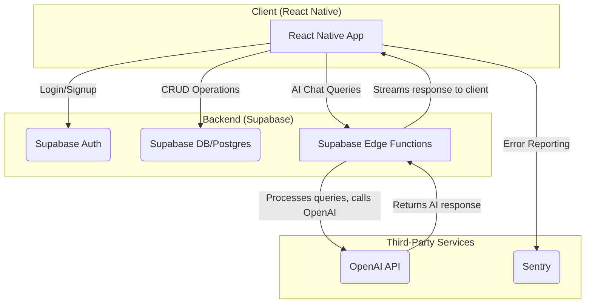

# Credify: Your AI-Powered Smart Credit Card Companion 🚀

**Stop leaving money on the table. Credify is the ultimate app for tracking, managing, and maximizing your credit card benefits, ensuring you get every dollar of value from your annual fees.**

Credify is an intelligent, AI-enhanced command center for your credit card perks. It transforms how you manage your finances by providing a unified dashboard to track and redeem benefits, smart reminders to prevent missed opportunities, and data-driven insights to maximize your return on investment.


## What is Credify? 🤔

Are you juggling multiple credit cards with a dizzying array of perks? From monthly dining credits and streaming subscriptions to annual travel stipends, it's nearly impossible to keep track of it all. You're paying for these benefits through annual fees—it's time to start using them.

Credify is your intelligent command center for credit card perks. We make it effortless to:

* **See Everything in One Place:** Add your credit cards and instantly see a unified dashboard of all your available benefits—monthly, quarterly, and annual.
* **Never Miss a Deadline:** Get smart, customizable reminders before any perk expires. We'll notify you when it's time to use your credits.
* **Redeem with a Single Tap:** Our app deep-links directly to the merchant apps and websites you need (like Uber, Grubhub, and airline portals), so you can redeem and track perks in seconds.
* **Track Your ROI:** Watch your savings add up! Credify visualizes your progress toward breaking even on annual fees, showing you the real-time value you've redeemed.

---

### **Update: Version 1.1 Features (Released 06/15/2025)**

This release focuses on a more robust user experience, deeper insights, and seamless integration.

*   **Revamped Onboarding Experience:** A step-by-step wizard that guides you through adding your cards, setting renewal dates, and instantly showing your potential annual savings.
*   **Enhanced Dashboard:** A more intuitive interface to view, sort, and filter your perks by card, category, or expiration date.
*   **Social Logins:** Sign up and log in faster with support for Apple and Google accounts.
*   **Interactive UI:**
    *   **Draggable Card Lists:** Organize your cards in the dashboard exactly how you want them.
    *   **Context Menus:** Long-press on a perk or card for quick actions.
    *   **Modern Bottom Sheets:** A clean, native feel for menus and selection options.
*   **Deeper Insights:** The new 'Insights' tab provides more detailed analytics on your redemption habits and which cards are giving you the most value.

---

## Core Features ✨

### 🧠 AI-Powered Financial Assistant
- **Conversational AI Chat:** Engage with an intelligent assistant powered by the OpenAI API. Ask complex questions about your benefits, get personalized advice on which card to use for a specific purchase, and receive summaries of your spending habits.
- **Smart Perk Matching:** The AI helps you understand and categorize your perks, making it easier to find and use the benefits that matter most to you.

### 📈 Intelligent Perk & ROI Tracking
- **Unified Dashboard:** Add all your credit cards to see a consolidated view of every available benefit—monthly, quarterly, and annual.
- **Real-Time ROI Dashboard:** Instantly see your return on investment for each card. Credify visualizes your progress toward breaking even on annual fees, showing you the real-time value you've redeemed.
- **Automated Reminders:** Get smart, customizable push notifications before any perk expires.

### 📊 Data-Driven Insights & Analytics
- **Spending Analysis:** Discover which cards provide the most value with detailed analytics on your redemption habits.
- **Visualized Data:** Interactive charts and graphs, including a 6-month history of perk redemptions, help you track usage and compare month-over-month. Features include ROI leaderboards, spending sparklines, and category-based bar charts.

### 🚀 Seamless User Experience
- **Modern, Interactive UI:** A clean, native-feel interface built for efficiency, featuring draggable card lists, context menus for quick actions, and polished bottom sheets.
- **One-Tap Redemptions:** Deep links take you directly to merchant apps and websites (e.g., Uber, Grubhub) to redeem perks in seconds.
- **Fluid Animations:** Built with **Moti & Reanimated** for a smooth, high-performance user experience with haptic feedback.
- **Guided Onboarding:** A multi-step wizard simplifies setup, guiding users to add cards and immediately see their potential annual savings.

---

## System Architecture

Credify is built on a modern, scalable, and serverless architecture. The system is designed for security, real-time data synchronization, and robust performance.



---

## AI-Powered RAG & Prompt Engineering

The core of Credify's intelligence lies in a sophisticated, two-stage Retrieval-Augmented Generation (RAG) pipeline. This system is designed to provide highly accurate, context-aware, and cost-effective recommendations by minimizing token usage and maximizing the relevance of the data sent to the LLM.

```mermaid
graph TD
    subgraph "Client (React Native)"
        A[User Query] --> B{Stage 1: Local Pre-Filtering};
        B -- "Filter & Rank Perks<br/>(Fuse.js)" --> C{Context Compression};
        C -- "Create Minified JSON<br/>(Lean Context)" --> D[Call Supabase Edge Function];
        H[Render Dynamic UI] <-- G{Parse Structured JSON};
    end

    subgraph "Backend"
        D -- "Execute Structured Prompt<br/>with Lean Context" --> E(OpenAI API);
        E -- "Returns Structured<br/>JSON Response" --> F[Supabase Edge Function];
    end
    
    F -- "Stream Response to Client" --> G;
```

### Advanced Prompt Engineering Techniques

The system's reliability hinges on advanced prompt engineering, which forces the LLM to act as a predictable, structured data source.

-   **Strict JSON Output:** The prompt commands the model to return **only a single, minified JSON object**. This output is governed by a rigid schema, ensuring that the response can be reliably parsed and rendered in the UI without unexpected formatting errors.
-   **Multi-Step Logic Injection:** The prompt defines a clear, 3-step prioritization logic (1. Category Match, 2. Urgency, 3. Value) that the LLM must follow. This offloads complex business logic into the prompt itself, ensuring consistent and high-quality sorting of recommendations.
-   **Dynamic Personalization & Formatting:** The AI is instructed to generate personalized `displayText` tailored to the user's query (e.g., mentioning "Chicago" if the user asks about a trip there). It is also required to use Markdown for bolding key entities, which the app then renders natively.
-   **Cost & Latency Optimization:**
    -   If the initial local filtering returns no relevant perks, **no API call is made**, saving costs and providing an instant response.
    -   The context sent to the AI is heavily minified (e.g., `cardName` becomes `cn`, `remainingValue` becomes `rv`), drastically reducing the token count for both the prompt and completion, which directly lowers API costs and improves latency.

---

## Technology Stack 💻

This project leverages a modern, robust, and scalable technology stack, ideal for building high-quality mobile applications.

### **Frontend**
- **Framework:** [React Native](https://reactnative.dev/) with [Expo (SDK 53)](https://expo.dev/) (Managed Workflow)
- **Language:** [TypeScript](https://www.typescriptlang.org/)
- **Navigation:** [Expo Router](https://docs.expo.dev/router/introduction/) for file-based routing & [React Navigation](https://reactnavigation.org/) for native stack/tab navigation.
- **Animations:** [Moti](https://moti.fyi/) & [Reanimated](https://docs.swmansion.com/react-native-reanimated/) for fluid, 60FPS animations.
- **UI Components:** Custom component library, [Gorhom Bottom Sheet](https://gorhom.github.io/react-native-bottom-sheet/), [Draggable FlatList](https://github.com/computerjazz/react-native-draggable-flatlist), and [Lottie](https://lottiefiles.com/) for complex animations.
- **Data Fetching & State:** React Context with Hooks for global state, [Async Storage](https://react-native-async-storage.github.io/async-storage/) for persistence.

### **Backend & Database**
- **Backend-as-a-Service (BaaS):** [Supabase](https://supabase.com/)
- **Database:** [Supabase Postgres](https://supabase.com/database) for relational data storage. The schema is meticulously designed and managed with version-controlled SQL migration scripts, defining tables for users, cards, perks, and redemption history.
- **Authentication:** [Supabase Auth](https://supabase.com/auth) for secure handling of users, including social logins (Apple, Google).
- **Serverless Functions:** [Supabase Edge Functions](https://supabase.com/functions) (written in TypeScript) to handle secure, server-side logic, such as calling the OpenAI API.
- **File Storage:** [Supabase Storage](https://supabase.com/storage) for managing user-generated content like avatars, including logic to handle uploads and cleanup of old files.

### **AI & Machine Learning**
- **AI Service:** [OpenAI API](https://openai.com/blog/openai-api) for natural language processing and powering the in-app financial assistant.

### **Testing & Quality Assurance**
- **Unit & Component Testing:** [Jest](https://jestjs.io/) with [React Native Testing Library](https://testing-library.com/docs/react-native-testing-library/intro/) for comprehensive testing of components and business logic.
- **Error Reporting:** [Sentry](https://sentry.io/) for real-time error monitoring and crash reporting in production.

### **DevOps & Tooling**
- **Build & Deployment:** [Expo Application Services (EAS)](https://expo.dev/eas) for creating and distributing builds for iOS and Android.
- **Environment Management:** Secure handling of environment variables and secrets using [Expo Application Services (EAS) Secrets](https://docs.expo.dev/eas/secrets/) for production builds.
- **Code Quality:** [ESLint](https://eslint.org/) and [Prettier](https://prettier.io/) to enforce consistent code style.

---

## Download Credify 🚀

You can download the official Credify app from our website:

**[getcredify.app](https://getcredify.app)**

Available now for iOS, with Android support coming soon!

---


## License 📄

This project is licensed under the MIT License - see the [LICENSE](LICENSE) file for details.

---

*Built with ❤️ by the Credify team* 
